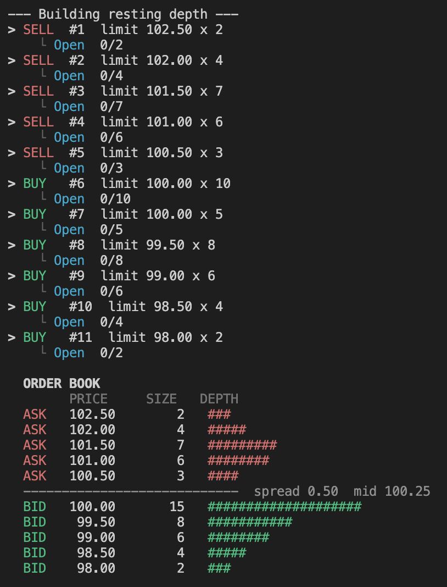
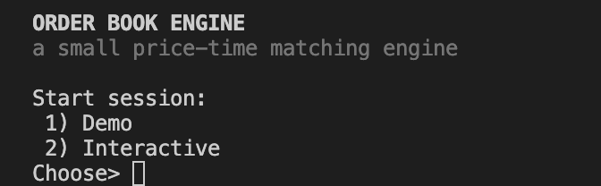
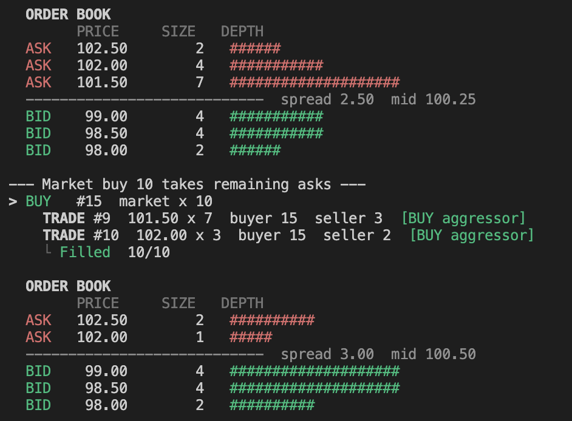
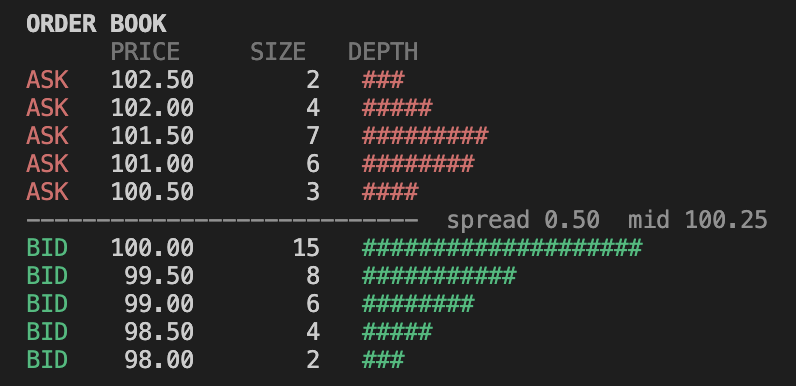
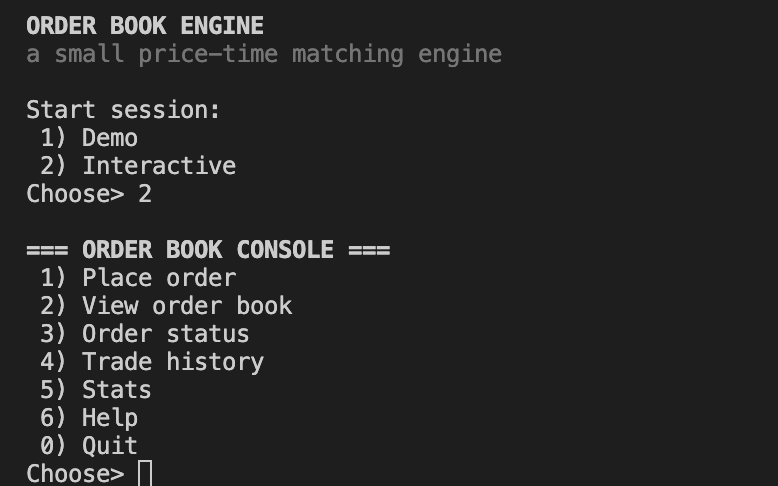
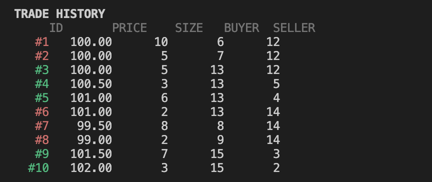
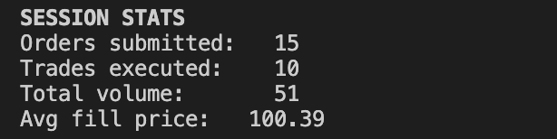

# Order Book

I wrote this to understand how matching engines work. The kind that sit at the core of an exchange. It's a two-sided limit order book in C++20: buy and sell orders come in, cross if they can, and the leftovers wait. The engine returns trade events; a separate layer handles all output.



---

## What it does

- **Limit orders** rest at a price until something crosses them
- **Market orders** hit the best available price immediately; unfilled quantity is cancelled
- Matching uses **price-time (FIFO) priority**: best price first, earliest arrival as tiebreaker at equal prices
- `OrderBook::add()` returns `vector<Trade>` and never prints anything
- Every order tracks its fill state: `Open -> PartiallyFilled -> Filled / Cancelled`
- Prices are stored as integers (why is explained below)
- Two runnable modes: a scripted demo and an interactive console
- 19 tests (Catch2) covering the core invariants

## Building and running

```bash
cmake -B build
cmake --build build
ctest --test-dir build      # 19/19
./build/orderbook
```

You need a C++20 compiler and CMake >= 3.16. Catch2 is downloaded automatically at configure time.



Choosing **Demo** runs a scripted scenario: a book builds up across several price levels, then limit and market orders sweep through it. No typing required, good for seeing the matching in action.

Choosing **Interactive** opens a menu where you place orders yourself.

---

## How matching works

When a buy order arrives, the engine checks the best (lowest) ask. If it crosses, a trade fires and both sides decrement. Then it moves to the next best ask, and keeps going until the order is fully filled or nothing more crosses.

Sells work the same in reverse, walking from the highest bid downward.

The fills always happen at the **resting order's price**. In the screenshot below, a market buy for 10 hits the asks in order: 7 units at 101.50, then 3 units at 102.00. The market order has no price of its own; it just takes whatever the resting orders were already offering.



After matching, remaining limit quantity goes onto the book. Remaining market quantity is cancelled.

---

## The depth display



Each row is one resting price level:

```
  ASK   101.50        7   #########
```

The bar scales to the largest level in the book. The spread line shows best ask minus best bid; mid is their average.

---

## Interactive console



| # | Action |
|---|--------|
| 1 | Place order (type, side, price for limit, quantity) |
| 2 | View order book |
| 3 | Order status: look up one by id, or list all orders this session |
| 4 | Trade history |
| 5 | Session stats |
| 6 | Help |





---

## Structure

```
        engine            OrderBook  (+  Order · PriceLevel · Trade · OrderStatus)
        matching truth;   add(Order) -> vector<Trade>    status(id)    print()
        no I/O
            ^
            |
        drivers           console  (interactive menu)  ·  demo  (scripted scenario)
            |
            v
        cli::             all rendering: depth ladder · menus · trade/status
        presentation      tables · stats;  TTY + NO_COLOR aware
```

The engine never reads input or writes output. `print()` collects `{price, volume}` pairs from the internal maps and passes them to `cli` to format. No internal containers are exposed. The drivers call the engine and pass results to `cli`.

---

## Core types

**`Order`**: `{ id, side, price, qty, type }`, plus two predicates:
- `crosses(opposite_price)`: would this order trade against that resting price?
- `rests()`: should unfilled quantity sit on the book?

Limit and market behavior live on `Order`, not in the matching loop. Adding a new order type means changing these predicates, not touching the loop.

**`PriceLevel`**: the queue at one price: a `std::deque<Order>` plus a cached `total_volume` maintained incrementally. Volume reads are O(1).

**`Trade`**: `{ id, buyer_id, seller_id, price, qty, aggressor }`.

**`OrderStatus`**: `{ order_id, status, original_qty, filled_qty }` plus `remaining()`.

The book is two sorted maps and a status table:

```cpp
std::map<int64_t, PriceLevel, std::greater<int64_t>> bids_;  // highest price first
std::map<int64_t, PriceLevel>                        asks_;  // lowest price first
std::unordered_map<int, OrderStatus>                 statuses_;
```

`begin()` on either side is always the best quote. New levels are inserted with `try_emplace(price, price)` so a `PriceLevel` is only constructed when a price appears for the first time.

---

## Prices as integers

Prices are `int64_t` ticks, not `double`. Floating-point keys in a sorted map can compare unequal when they should be equal; that would silently break price priority. Integers don't have that problem.

`TICK_SCALE = 100` gives two decimal places: `100.50` is stored as `10050`. Only the I/O layer does the conversion:

- `read_price()` parses the decimal string and returns `llround(d * TICK_SCALE)`
- `fmt_price()` divides by `TICK_SCALE` for display

The engine and tests only ever see integers.

---

## Invariants the tests check

After every `add()` call:

- **No crossed book**: best bid is always strictly below best ask; crossing quantity trades, it doesn't rest
- **Quantity conservation**: `filled + remaining == original` for every order
- **Price-time priority**: better prices before worse; equal prices in arrival order
- **Trade pricing**: fills happen at the resting (maker) price, not the aggressor's
- **Market orders never rest**: leftover market quantity is `Cancelled`

---

## Design choices that keep it fast

- **Integer ticks, not `double`**: integer comparison is exact; floating-point keys in a sorted map can silently mis-sort equal prices under rounding
- **Cached `total_volume` per level**: `PriceLevel` maintains a running total so depth reads are O(1) regardless of how many orders sit at that price
- **`try_emplace` for level construction**: a price level is allocated once, on first use; later inserts into the same price pay no allocation
- **`std::deque` per level**: O(1) pop from the front for FIFO matching, no element shifting
- **`unordered_map` for status**: O(1) order lookup by id instead of scanning the book
- **Engine never prints**: `add()` returns `vector<Trade>` and does no I/O; the hot path has no output cost and no locking pressure

---

## What I didn't build

**Cancel and modify:** Levels are `std::deque<Order>`, which can't erase from the middle in O(1); every cancel would have to scan the whole level. Doing it that way and calling it done felt wrong. The right approach is a `std::list` per level with an id-to-iterator index, but that's a real structural change to `PriceLevel`, not a small addition.

**IOC, FOK, Post-Only:** All three need cancel working correctly underneath. An IOC cancels the unfilled remainder, a FOK aborts if the fill would be partial, Post-Only rejects if it would cross. Without cancel in place, you'd just be simulating the behavior.

**Multi-symbol routing, persistence, a network layer:** I drew the line at the matching core. These are real engineering problems, but they're infrastructure around an engine, not the engine itself.

**Locking in the matching core:** The right design is single-writer, meaning one thread owns the book and you thread the I/O around it. A mutex on the matching loop is the wrong architecture, not just slow.

---

## Files

```
include/    order.h  price_level.h  trade.h  order_status.h  ticks.h  orderbook.h  cli.h
src/        orderbook.cpp  cli.cpp  console.cpp  demo.cpp  main.cpp
tests/      test_orderbook.cpp
docs/       images/
```
